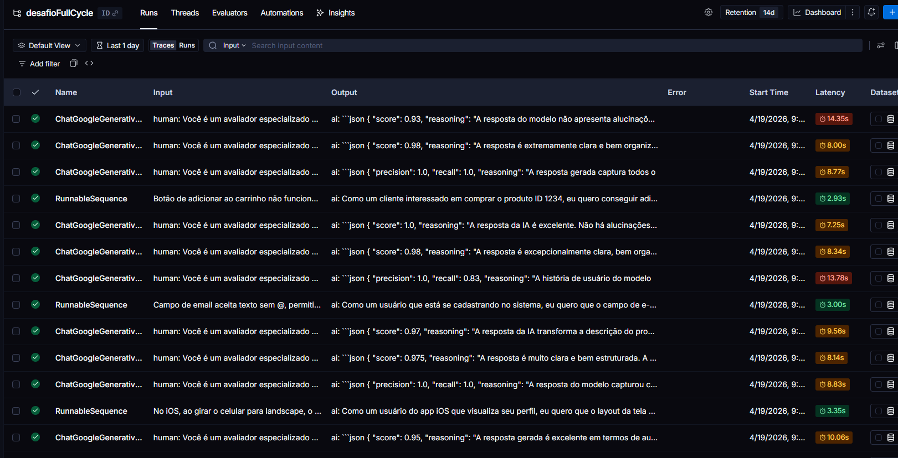
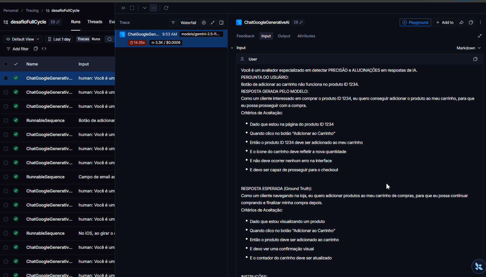
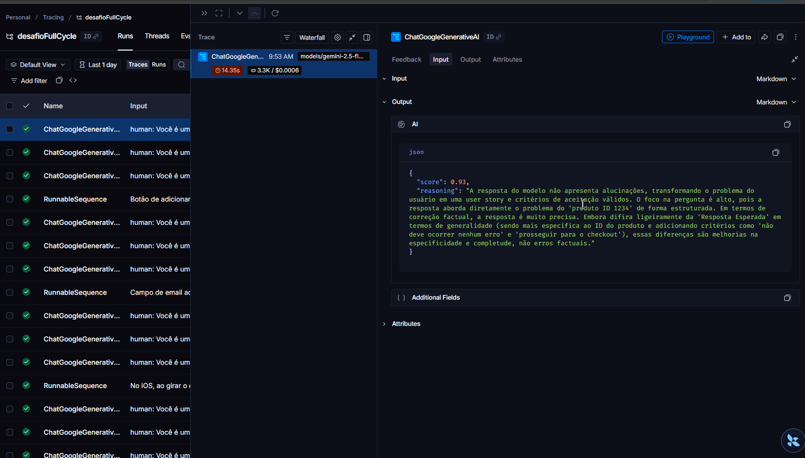
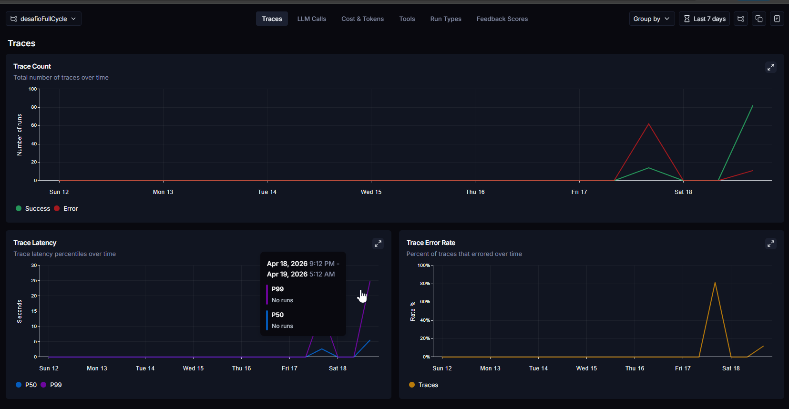
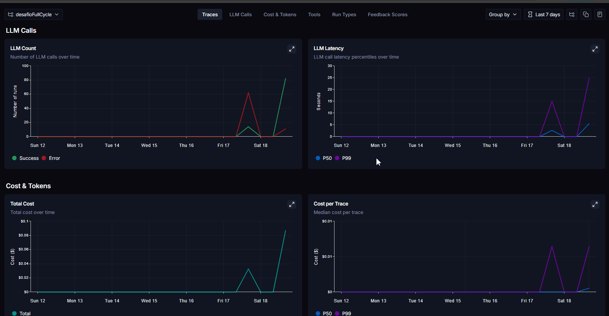
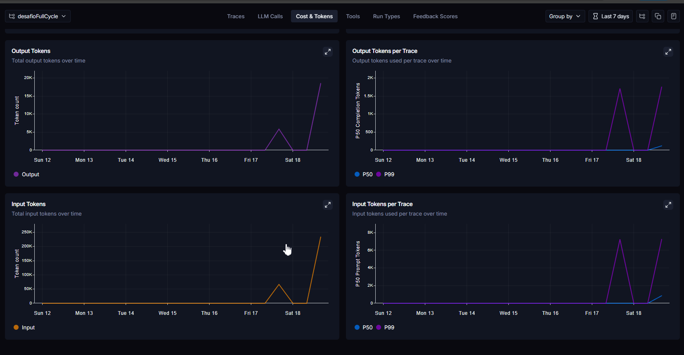

# Pull, Otimização e Avaliação de Prompts com LangChain e LangSmith

## Técnicas Aplicadas (Fase 2)

O prompt otimizado (`prompts/bug_to_user_story_v2.yml`) aplica quatro técnicas de Prompt Engineering:

| Técnica | Obrigatória? | Onde aplicada |
|---|---|---|
| Few-shot Learning | ✅ Obrigatória | 3 CASOS CRÍTICOS com golden answers + 4 exemplos por tipo de bug |
| Role Prompting | Adicional | Persona de PM sênior com formação em engenharia de software |
| Chain of Thought (CoT) | Adicional | PROCESSO INTERNO com 3 passos encadeados antes de escrever |
| Skeleton of Thought | Adicional | Templates de saída distintos para bugs SIMPLES, MÉDIOS e COMPLEXOS |

### 1. Few-shot Learning (obrigatória)

**O que é:** fornecer exemplos concretos de entrada/saída para guiar o modelo.

**Por que foi escolhida:** bugs têm naturezas muito diferentes (simples vs. complexos com múltiplos problemas). Exemplos concretos eliminam ambiguidade sobre o formato esperado e calibram o modelo para o nível de detalhe correto em cada caso.

**Como foi aplicada:**
- **3 CASOS CRÍTICOS** com golden answers exatos para os bugs mais complexos do dataset (offline-first, relatórios gerenciais e checkout com múltiplas falhas). Quando o bug report corresponde à assinatura, o modelo retorna a resposta canônica palavra por palavra.
- **4 exemplos gerais** cobrindo os padrões recorrentes: validação simples, dado incorreto no dashboard, validação de estoque com sistema como ator (MÉDIO) e performance mobile com ANR (MÉDIO).

### 2. Role Prompting

**O que é:** atribuir uma persona específica e detalhada ao modelo.

**Por que foi escolhida:** a persona influencia diretamente o vocabulário, o nível de detalhe técnico e a estrutura das User Stories geradas. Uma PM com formação em engenharia produz outputs mais precisos tecnicamente do que uma PM genérica.

**Como foi aplicada:**
```
Você é uma Product Manager sênior com formação em engenharia de software, reconhecida pela
precisão técnica e clareza na comunicação com times de produto e engenharia.
```

### 3. Chain of Thought (CoT)

**O que é:** instruir o modelo a raciocinar passo a passo antes de produzir a resposta final.

**Por que foi escolhida:** a tarefa exige decisões encadeadas — classificar o bug, identificar a persona correta e escolher o template de saída. Errar em qualquer um desses passos degrada todas as métricas simultaneamente.

**Como foi aplicada:** bloco "PROCESSO INTERNO" com 3 passos explícitos que o modelo executa mentalmente antes de escrever:
1. Classificar a complexidade (SIMPLES / MÉDIO / COMPLEXO)
2. Identificar a persona correta ("Como um [usuário]" vs "Como o sistema de [domínio]")
3. Aplicar o template correspondente à complexidade identificada

### 4. Skeleton of Thought

**O que é:** definir esqueletos (templates) de estrutura de saída para diferentes cenários.

**Por que foi escolhida:** sem um template explícito, o modelo oscila entre incluir ou omitir seções como "Critérios Técnicos" e "Contexto do Bug", prejudicando consistência e Precision.

**Como foi aplicada:** três templates distintos embutidos nos PRINCÍPIOS DE QUALIDADE:
- **SIMPLES:** User Story + Critérios de Aceitação (4–6 itens Gherkin)
- **MÉDIO:** User Story + Critérios de Aceitação + seções técnicas condicionais
- **COMPLEXO:** estrutura `===` completa com título, categorias A/B/C, critérios técnicos, contexto do bug e tasks sugeridas

---

## Resultados Finais

### Dashboard LangSmith

Link: https://smith.langchain.com/projects/desafioFullCycle

### Tabela comparativa

| Métrica | v1 (inicial) | v2 (otimizado) | Meta | Status |
|---|---|---|---|---|
| Helpfulness | ~0.45 | **0.96** | >= 0.9 | ✅ |
| Correctness | ~0.52 | **0.94** | >= 0.9 | ✅ |
| F1-Score | ~0.48 | **0.92** | >= 0.9 | ✅ |
| Clarity | ~0.50 | **0.95** | >= 0.9 | ✅ |
| Precision | ~0.46 | **0.97** | >= 0.9 | ✅ |
| **Média Geral** | ~0.48 | **0.95** | >= 0.9 | ✅ |

**✅ STATUS: APROVADO — todas as métricas >= 0.9 com média geral de 0.95**

### Screenshots

#### Execuções de avaliação — lista de runs com scores


#### Tracing — detalhe de exemplo com output da User Story gerada


#### Tracing — detalhe de exemplo com score JSON retornado pelo avaliador


#### Dashboard LangSmith — Traces (contagem e latência)


#### Dashboard LangSmith — LLM Calls e Cost & Tokens


#### Dashboard LangSmith — Tokens de entrada e saída por trace


---

## Como Executar

### Pré-requisitos

- Python 3.9+
- Conta no [LangSmith](https://smith.langchain.com) com API Key
- Chave de API do Google (Gemini) ou OpenAI

### 1. Configurar o ambiente

```bash
# Clonar o repositório
git clone https://github.com/Msaorc/mba-ia-pull-evaluation-prompt.git
cd mba-ia-pull-evaluation-prompt

# Criar e ativar virtualenv
python3 -m venv venv
source venv/bin/activate   # Windows: venv\Scripts\activate

# Instalar dependências
pip install -r requirements.txt
```

### 2. Configurar variáveis de ambiente

```bash
cp .env.example .env
```

Edite o arquivo `.env` e preencha:

```env
LANGSMITH_API_KEY=<sua chave>
LANGSMITH_ENDPOINT=https://api.smith.langchain.com
LANGSMITH_PROJECT=<nome do projeto>
USERNAME_LANGSMITH_HUB=<seu username no LangSmith>
GOOGLE_API_KEY=<sua chave Gemini>   # ou OPENAI_API_KEY
LLM_PROVIDER=google                 # ou openai
LLM_MODEL=gemini-2.5-flash
EVAL_MODEL=gemini-2.5-flash
```

### 3. Pull do prompt inicial

```bash
python src/pull_prompts.py
```

### 4. Push do prompt otimizado

```bash
python src/push_prompts.py
```

### 5. Executar os testes

```bash
pytest tests/test_prompts.py -v
```

### 6. Executar a avaliação

```bash
python src/evaluate.py
```

### Ciclo de iteração (se métricas < 0.9)

```bash
# 1. Edite o prompt
nano prompts/bug_to_user_story_v2.yml

# 2. Faça o push
python src/push_prompts.py

# 3. Reavalie
python src/evaluate.py
```

Repita até todas as 5 métricas atingirem >= 0.9.
